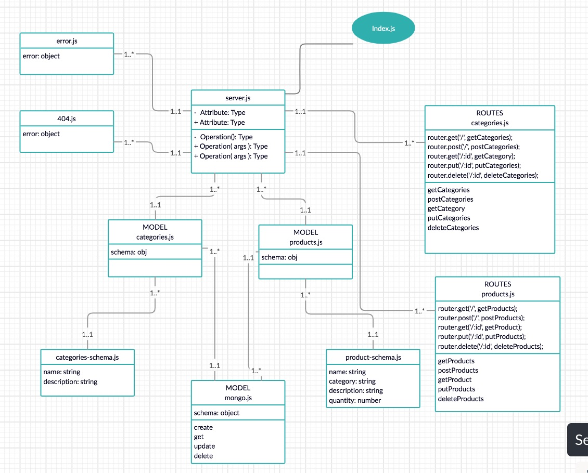

# LAB - API Server

## Lab 09

### Author: Jessica Walters

### Links and Resources
* [submission PR](https://github.com/401-advanced-javascript-jessica/401-lab-9/pull/5)
* [travis](https://www.travis-ci.com/401-advanced-javascript-jessica/401-lab-08)
* [back-end](https://jessica-401-lab-08.herokuapp.com)

#### Documentation
* [api docs](https://app.swaggerhub.com/apis/jessicakwalters/lab-082/0.1)
* [jsdoc](https://jessica-401-lab-08.herokuapp.com/docs)

### Setup
#### `.env` requirements
* `PORT` - 3000
* `MONGODB_URI` - `mongodb://localhost:27017/lab08`

#### Running the app
* `npm start`
* Endpoint: `/api/v1/categories`
  * Returns a JSON object category data in it.
* Endpoint: `/api/v1/categories`
  * Returns a JSON object with product data in it.
  
#### Tests
* `npm test`

#### UML

